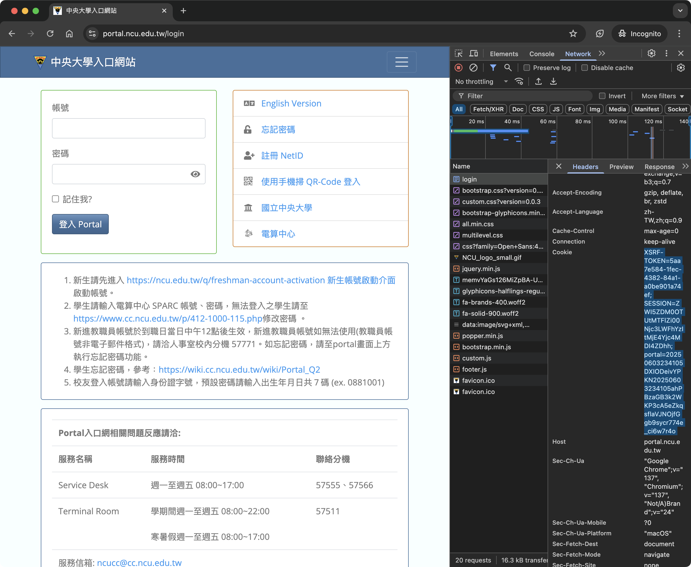

# MCL Automatic Sign-in System


An auto sign-in/sign-out system for NCU HumanSys.

## Hub

**GitHub**: [wulukewu/mcl-sign-in-system](https://github.com/wulukewu/mcl-sign-in-system)

**Docker Hub**: [wulukewu/mcl-sign-in-system](https://hub.docker.com/r/wulukewu/mcl-sign-in-system)

## Quick Start

Run the container with the following command, replacing `your_username`, `your_password`, and `your_otpauth_url` with your actual credentials:

```bash
docker run -e username=your_username \
           -e password=your_password \
           -e otpauth=your_otpauth_url \
           -e inorout=signout \
           -e cookies="key1=value1; key2=value2; ..." \
           -e discord_token=your_discord_token \
           -e discord_guild_id=your_discord_guild_id \
           -e discord_channel_id=your_discord_channel_id \
           wulukewu/mcl-sign-in-system:latest
```

To sign in instead of signing out (which is the default), omit the `-e inorout=signout` line. Also, omit the `-e otpauth=your_otpauth_url` line if you don't use OTP. The `cookies` parameter is optional; omit it if you don't want to use cookies. The Discord parameters are optional; omit them if you don't want Discord notifications.

## Secrets Configuration (GitHub Actions)

If you're using GitHub Actions, add the following secrets under your repository settings:

- `username`: Your Student ID used for login.
- `password`: Password for your portal login.
- `otpauth` [optional]: OTP URL to generate a one-time password (OTP) for two-factor authentication.
- `cookies` [optional]: String of cookies in the format `key1=value1; key2=value2; ...` to use for authentication.
- `discord_token` [optional]: Discord bot token to send notifications.
- `discord_guild_id` [optional]: Discord guild (server) ID where the notification should be sent.
- `discord_channel_id` [optional]: Discord channel ID where the notification should be sent.
  Remember to adjust the `inorout` value as needed.

## Parameters

The following parameters are configured using environment variables. These can be set using the `-e` flag when running `docker run` or by defining them in your shell environment.

- **`inorout`**: Specify `"signin"` or `"signout"` for the desired action. If not specified, the script will attempt to sign out first; if sign out is not possible, it will attempt to sign in automatically.
- **`username`**: Your Student ID used for login.
- **`password`**: Password for your portal login.
- **`otpauth`** [optional]: OTP URL to generate a one-time password (OTP) for two-factor authentication. If not provided, OTP authentication will be skipped. Set to `"None"` if you do not use OTP.
- **`cookies`** [optional]: String of cookies in the format `key1=value1; key2=value2; ...` to use for authentication. If not provided, cookies will not be used.
- **`discord_token`** [optional]: Discord bot token to send notifications. If provided, a notification will be sent to the specified channel.
- **`discord_guild_id`** [optional]: Discord guild (server) ID where the notification should be sent. Required if `discord_token` is provided.
- **`discord_channel_id`** [optional]: Discord channel ID where the notification should be sent. Required if `discord_token` is provided.

## How to Get Cookies from Chrome

<details>
    <summary>Click to expand for instructions</summary>

To obtain your cookies from Chrome, follow these steps:

1. Open Chrome and log in to the [NCU portal](https://portal.ncu.edu.tw). (It is suggested to check the `Remember me` checkbox if you want to run this automatically.)
2. Right-click anywhere on the page and select **Inspect** to open Developer Tools.
3. Go to the **Network** tab.
4. Refresh the page if needed, then click on any request (such as the first entry).
5. In the right panel, select the **Headers** tab.
6. Scroll down to the **Request Headers** section and find the **Cookie** field.
7. Copy the entire value of the **Cookie** header (e.g., `key1=value1; key2=value2; ...`).



</details>

## Usage

To run the script _directly_ (outside of Docker), you must set the required environment variables _before_ executing the `python main.py` command. The method for setting environment variables depends on your operating system and shell. Here are a few examples:

**Linux/macOS (Bash):**

```bash
export username=your_username
export password=your_password
export otpauth=your_otpauth_url
export inorout=signin_or_signout  # Optional. If not set, the script will try to sign out first, then sign in if sign out is not possible.
export cookies="key1=value1; key2=value2" # Optional
export discord_token=your_discord_token # Optional
export discord_guild_id=your_discord_guild_id # Optional
export discord_channel_id=your_discord_channel_id # Optional
python main.py
```

**Windows (Command Prompt):**

```cmd
set username=your_username
set password=your_password
set otpauth=your_otpauth_url
set inorout=signout  # Optional. If not set, the script will try to sign out first, then sign in if sign out is not possible.
set cookies="key1=value1; key2=value2" # Optional
set discord_token=your_discord_token # Optional
set discord_guild_id=your_discord_guild_id # Optional
set discord_channel_id=your_discord_channel_id # Optional
python main.py
```

**Windows (PowerShell):**

```powershell
$env:username="your_username"
$env:password="your_password"
$env:otpauth="your_otpauth_url"
$env:inorout="signin_or_signout" # Optional. If not set, the script will try to sign out first, then sign in if sign out is not possible.
$env:cookies="key1=value1; key2=value2" # Optional
$env:discord_token="your_discord_token" # Optional
$env:discord_guild_id="your_discord_guild_id" # Optional
$env:discord_channel_id="your_discord_channel_id" # Optional
python main.py
```

**Important:** Remember to replace `your_username`, `your_password`, `your_otpauth_url`, `signin_or_signout`, `your_discord_token`, `your_discord_guild_id`, and `your_discord_channel_id` with your actual values. The `export` (Linux/macOS) or `set` (Windows) commands set the environment variables for the current shell session.

## Docker

To build and run the Docker container, use the following commands. Make sure to replace `your_username`, `your_password`, `your_otpauth_url`, `signin_or_signout`, `your_discord_token`, `your_discord_guild_id`, and `your_discord_channel_id` with your actual credentials.

```sh
docker build -t mcl-sign-in-system .
docker run -e username=your_username \
           -e password=your_password \
           -e otpauth=your_otpauth_url \
           -e inorout=signin_or_signout \
           -e cookies=your_cookies \
           -e discord_token=your_discord_token \
           -e discord_guild_id=your_discord_guild_id \
           -e discord_channel_id=your_discord_channel_id \
           mcl-sign-in-system
```

If you want to sign in or out, you can set the `-e inorout=signin` or `-e inorout=signout` line. If you omit the `inorout` parameter, the script will try to sign out first, and if not possible, will attempt to sign in automatically. The `cookies` parameter is optional; omit it if you don't want to use cookies. The Discord parameters are optional; omit them if you don't want Discord notifications.

## Return Codes

The script will return the following codes to indicate the outcome of the execution:

- `000`: Successfully completed the sign-in or sign-out action.
- `100`: Alert message detected, nothing to do.
- `200`: Potentially malicious website detected.
- `300`: Failed to solve reCAPTCHA.
- `400`: Failed to find the audio source for reCAPTCHA.
- `500`: Failed to enter the audio passcode.
- `600`: Invalid `inorout` option.

## References

- [VS Code + Python + Selenium Automation Testing Part 1](https://medium.com/begonia-design/vs-code-python-selenium-%E8%87%AA%E5%8B%95%E5%8C%96%E6%B8%AC%E8%A9%A6-part-1-30d6c0ea92af)
- [Day 15: Dynamic Web Page Scraping 2 - Selenium Data Location Functions](https://ithelp.ithome.com.tw/articles/10300961)
- [【 Python 】利用 .env 與環境變數隱藏敏感資訊](https://learningsky.io/python-use-environmental-variables-to-hide-sensitive-information/)
- [Pull a certain branch from the remote server](https://stackoverflow.com/questions/1709177/pull-a-certain-branch-from-the-remote-server)
- [recaptcha_v2_solver](https://github.com/ohyicong/recaptcha_v2_solver)
